# 🛒 EProject Phase 1: Microservices E-Commerce Platform

A microservices-based e-commerce platform built with Node.js, Express, MongoDB, and RabbitMQ, fully containerized with Docker.

## 🏗️ Architecture

```
API Gateway (3003)
    ├── Auth Service (3000) → MongoDB
    ├── Product Service (3001) → MongoDB + RabbitMQ
    └── Order Service (3002) → MongoDB + RabbitMQ
```

**Services:**
- **API Gateway** (3003): Routes requests to microservices
- **Auth Service** (3000): User authentication with JWT
- **Product Service** (3001): Product CRUD and order creation
- **Order Service** (3002): Processes orders via RabbitMQ
- **MongoDB** (27017): Data persistence
- **RabbitMQ** (5672, 15672): Message queue

## 🚀 Quick Start

### Prerequisites
- Docker Desktop
- Git

### Setup

1. **Clone repository:**
```bash
git clone <your-repo-url>
cd EProject-Phase-1
```

2. **Configure environment variables:**

Create `.env` files with these settings:

**Root `.env`:**
```env
JWT_SECRET=your_secret_key
```

**`auth/.env`:**
```env
MONGODB_AUTH_URI=mongodb://mongo:27017/auth_db
JWT_SECRET=your_secret_key
```

**`product/.env`:**
```env
MONGODB_PRODUCT_URI=mongodb://mongo:27017/product_db
RABBITMQ_HOST=rabbitmq
RABBITMQ_USER=your_user
RABBITMQ_PASS=your_pass
JWT_SECRET=your_secret_key
```

**`order/.env`:**
```env
MONGODB_ORDER_URI=mongodb://mongo:27017/order_db
RABBITMQ_HOST=rabbitmq
RABBITMQ_USER=your_user
RABBITMQ_PASS=your_pass
```

3. **Start services:**
```bash
docker-compose up -d
```

4. **Verify:**
```bash
docker-compose ps
```

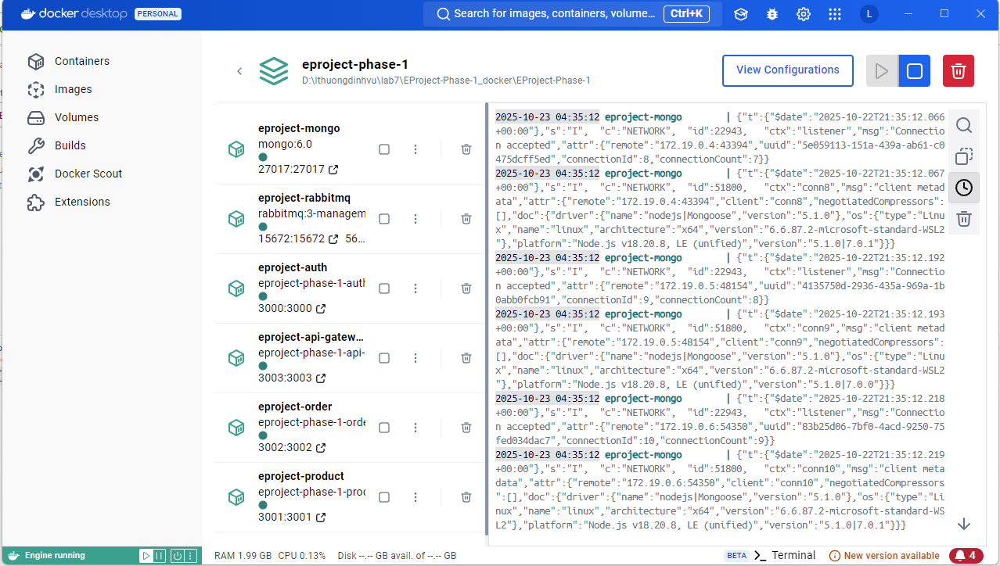

## 📖 API Documentation

**Base URL:** `http://localhost:3003`

### Authentication

#### Register
```http
POST /auth/register
Content-Type: application/json

{
  "username": "john",
  "password": "pass123"
}
```
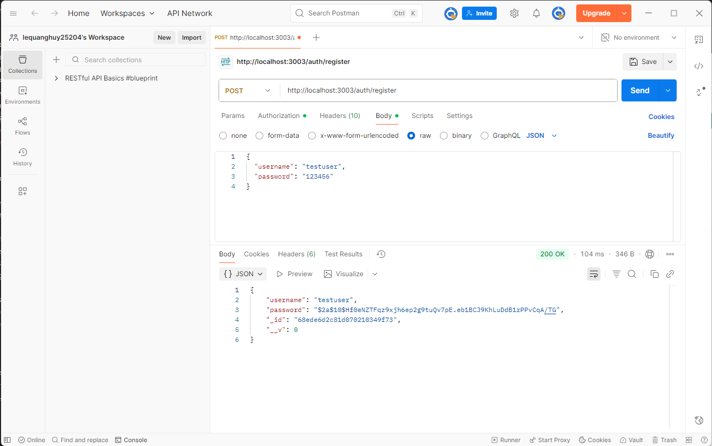

#### Login
```http
POST /auth/login
Content-Type: application/json

{
  "username": "john",
  "password": "pass123"
}
```
**Save the token from response!**

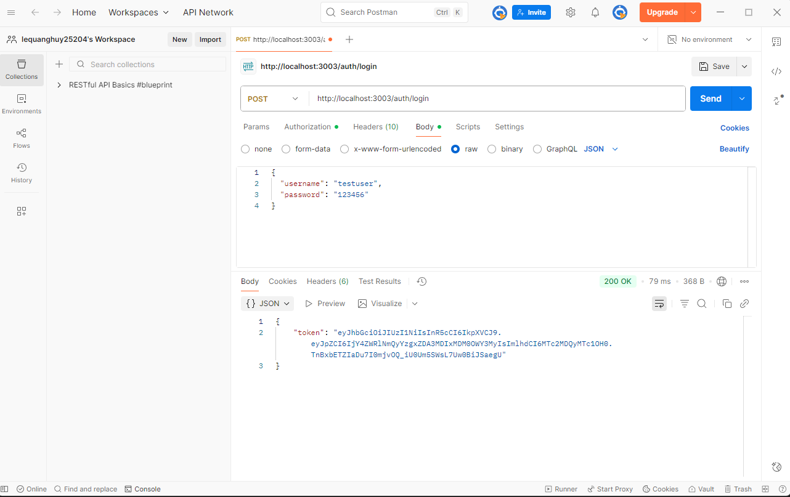

#### Dashboard (Protected)
```http
GET /auth/dashboard
Authorization: Bearer <token>
```

**With token:**
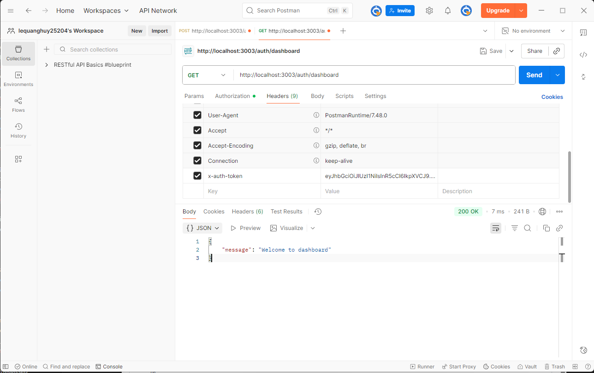

**Without token:**
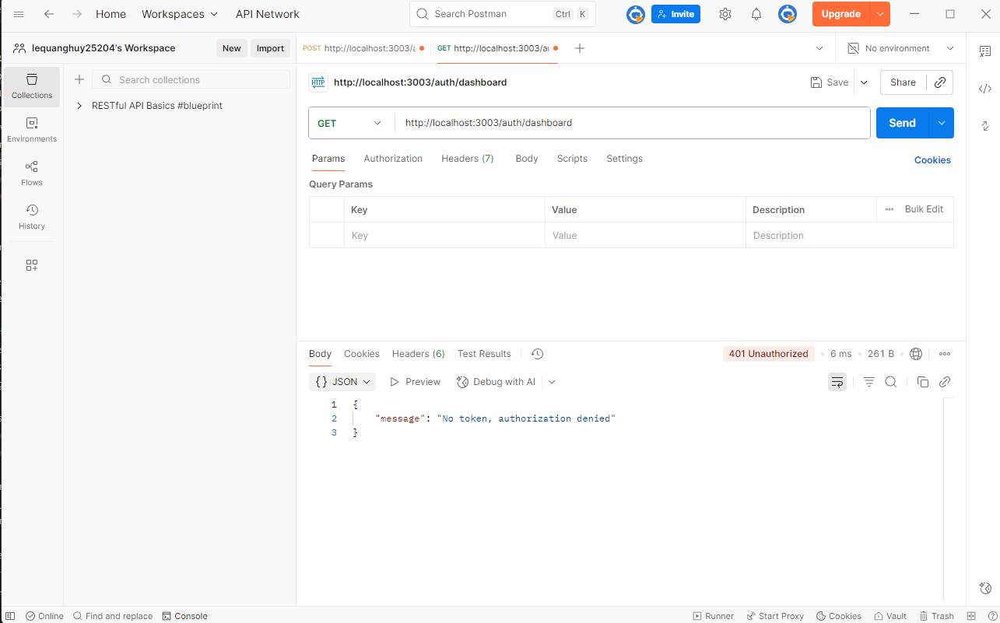

### Products

#### Create Product
```http
POST /products/api/products
Authorization: Bearer <token>
Content-Type: application/json

{
  "name": "iPhone 15",
  "price": 999,
  "description": "Latest iPhone"
}
```

**With token:**
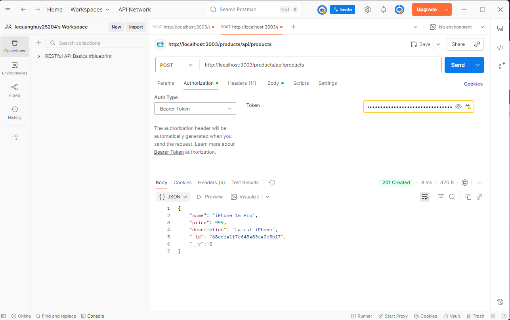

**Without token:**
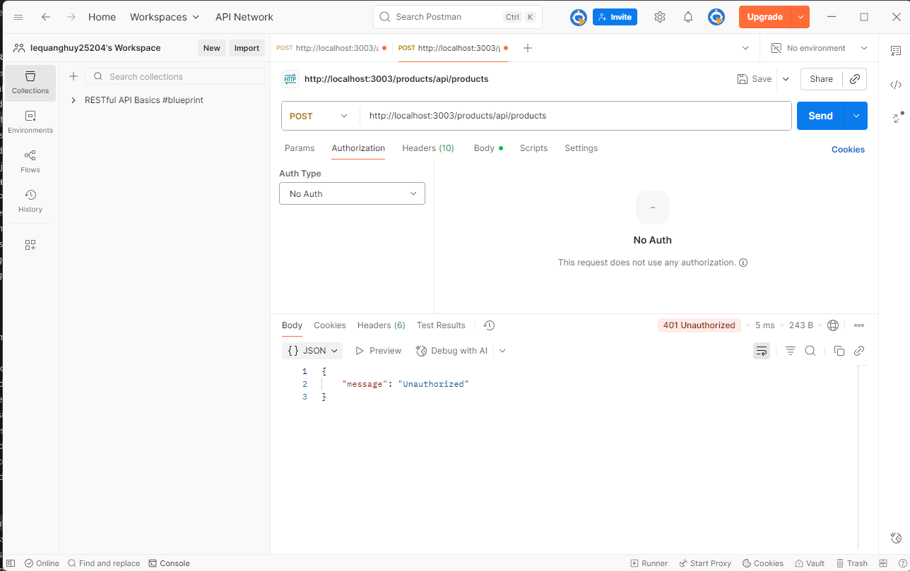

#### Get All Products
```http
GET /products/api/products
Authorization: Bearer <token>
```
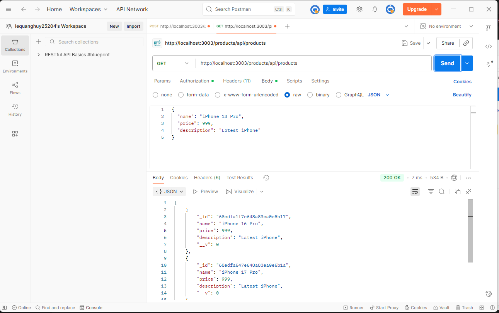

### Orders

#### Create Order
```http
POST /products/api/products/buy
Authorization: Bearer <token>
Content-Type: application/json

{
  "ids": ["product_id_1", "product_id_2"]
}
```

**With token:**
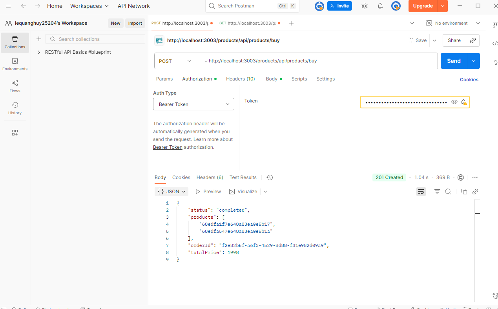

**Without token:**
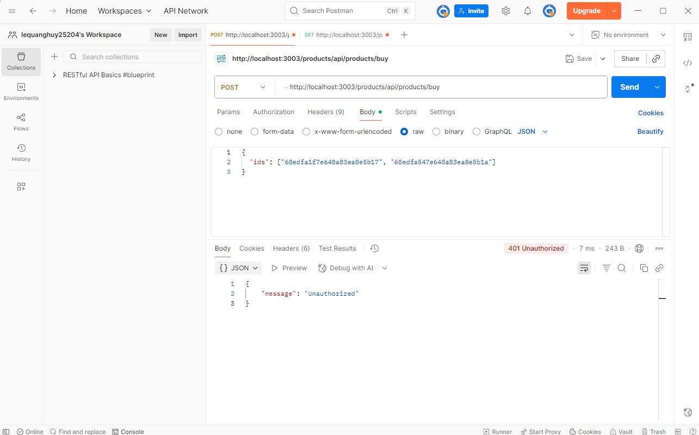

## 🐳 Docker Commands

**Start all services:**
```bash
docker-compose up -d
```

**Stop services:**
```bash
docker-compose down
```

**Rebuild after code changes:**
```bash
docker-compose up -d --build
```

**View logs:**
```bash
docker-compose logs -f
docker-compose logs -f product
```

**Rebuild specific service:**
```bash
docker-compose up -d --build product
```

## 🔧 Troubleshooting

### Port conflict (MongoDB)
```powershell
# Windows
Stop-Service MongoDB
```

### Code changes not reflected
```bash
docker-compose up -d --build <service>
```

### View errors
```bash
docker-compose logs <service>
```

### JWT errors
- Ensure same `JWT_SECRET` in all `.env` files
- Use format: `Authorization: Bearer <token>`

### MongoDB connection issues
- Use `mongodb://mongo:27017` (not `localhost`)
- Check container running: `docker-compose ps`

## 📁 Project Structure

```
EProject-Phase-1/
├── docker-compose.yml
├── .env
├── api-gateway/
│   ├── Dockerfile
│   ├── index.js
│   └── package.json
├── auth/
│   ├── Dockerfile
│   ├── .env
│   └── src/
│       ├── controllers/
│       ├── models/
│       ├── services/
│       └── app.js
├── product/
│   ├── Dockerfile
│   ├── .env
│   └── src/
│       ├── controllers/
│       ├── models/
│       ├── routes/
│       ├── services/
│       └── utils/
├── order/
│   ├── Dockerfile
│   ├── .env
│   └── src/
│       ├── models/
│       └── utils/
└── public/img/
```

## 🔒 Security Notes

⚠️ **Before deploying to production:**
- Change `JWT_SECRET` to strong random string
- Change RabbitMQ credentials
- Don't commit `.env` files to Git
- Add `.env` to `.gitignore`

## 🧪 Testing with Postman

1. Register user
2. Login → save token
3. Set token in Authorization header
4. Create products
5. Create orders

**RabbitMQ UI:** http://localhost:15672 (admin/admin123)

## 📊 Environment Configuration


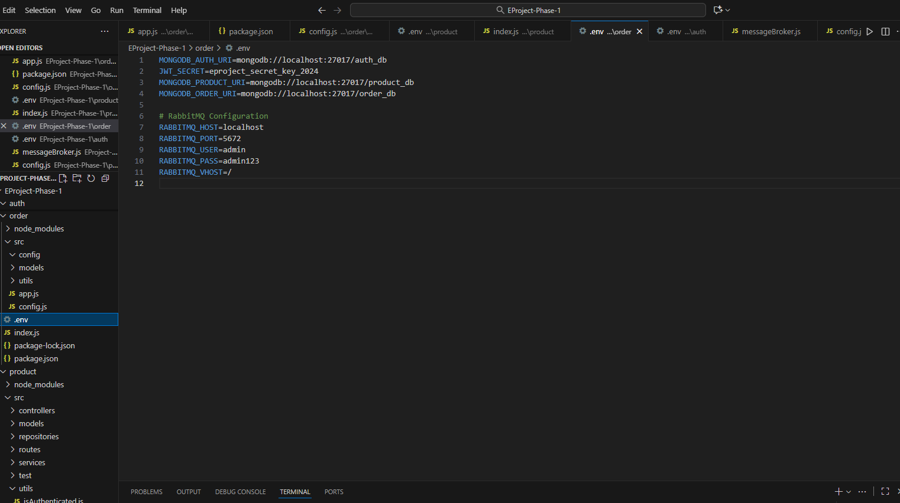

## 🛠️ Tech Stack

- **Backend:** Node.js 18, Express.js
- **Database:** MongoDB 6.0
- **Message Queue:** RabbitMQ 3
- **Auth:** JWT
- **Container:** Docker, Docker Compose

## 📝 License

ISC License

## 👨‍💻 Author

**Le Quang Huy** - Student ID: 22633191

---

⭐ Star this repo if you find it helpful!
